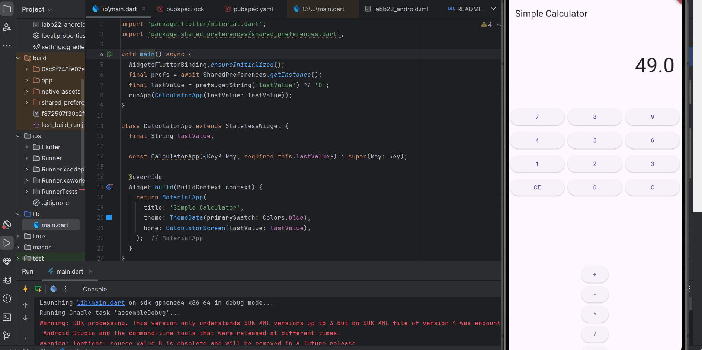

 Simple Calculator App
Overview
The Simple Calculator App is a Flutter application that performs basic arithmetic operations like addition, subtraction, multiplication, and division. It supports persistent state by saving the last calculated value using SharedPreferences.

Features
Supports addition, subtraction, multiplication, and division operations.
Saves the last calculated result for easy access when the app is reopened.
Limits the display to 8 digits.
Handles division by zero with an error message.
Provides clear and clear entry options.
Getting Started
Prerequisites
Before running the app, ensure you have the following installed:

Flutter SDK
Dart SDK
SharedPreferences package
Installation Steps
Clone or download the repository.
Navigate to the project folder:
sh
Copy
Edit
cd simple_calculator_app
Install the required dependencies:
sh
Copy
Edit
flutter pub get
Run the app:
sh
Copy
Edit
flutter run
Dependencies
This app uses the following dependencies:

yaml
Copy
Edit
dependencies:
  flutter:
    sdk: flutter
  shared_preferences: ^2.0.15
How to Use
Launch the app to start using the calculator.
Tap on the digits to input numbers.
Use the operator buttons (+, -, *, /) to perform operations.
Tap = to see the result.
Tap CE to clear the current entry, or C to clear everything.
Error Handling
Displays "ERROR" when attempting division by zero.
Limits the result display to 8 digits to avoid overflow.
Saves the last calculated value even after the app is closed

 ### Screenshot

##
created this app with the help of AI
